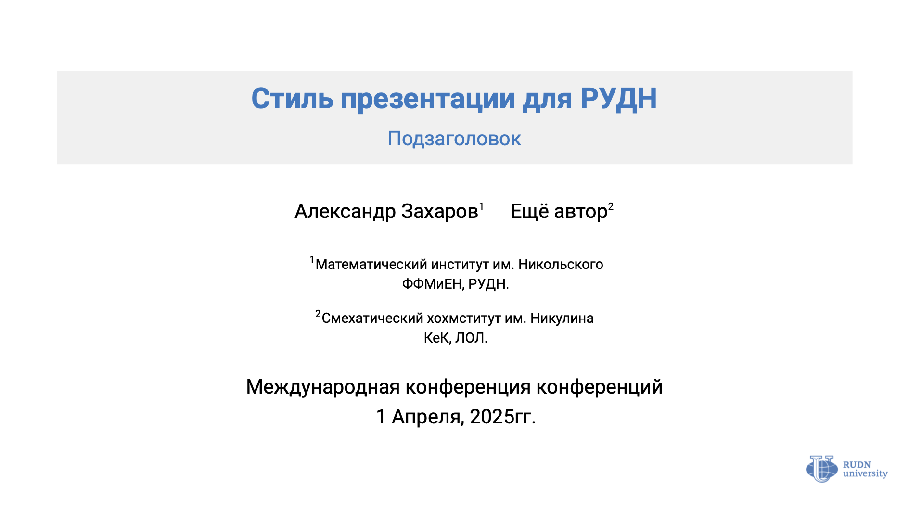

# Шаблон презентации RUDN для Beamer


Современный шаблон для презентаций РУДН.

## Характеристики макета

- Официальная цветовая схема РУДН (синий, красный и зеленый взяты из официального брендбука)
- Минималистичный дизайн с хорошей типографикой
- Соотношение сторон 16:9

## Пример презентации



## Требования
> [!IMPORTANT]
> **Настоятельно рекомендуется установить полный пакет дистрибутива LaTeX на вашу систему.**
> Для Windows - это MikTeX, для macOS - MacTeX, для большинства дистрибутивов Linux - TeX Live.

Если вы по каким-то причинам не можете этого сделать, то необходимый минимум установленного ПО примерно такой:
- Рекомендуется использовать LuaLaTeX (XeLaTeX не проверялся)
- Установленный пакет Beamer
- Установленные (желательно через систему пакетов LaTeX) шрифты:
  - Inter (основной)
  - IBM Plex Mono (моноширинный)
  - Concrete Math (математический)

## Установка

1. Клонируйте репозиторий или скачайте файлы `.sty`, а также папку `img`
2. Поместите файлы `.sty` и папку `img` в корневой каталог вашего проекта
3. Подключите тему в своём файле: `\usetheme[minimal]{RUDN}`

## Использование

После выполнения установки, создайте свой файл с презентацией и скомпилируйте его командой:
```shell
lualatex --interaction=nonstopmode <название_вашего_файла.tex>
```

## Лицензия
Проект распространяется под лицензией MIT
